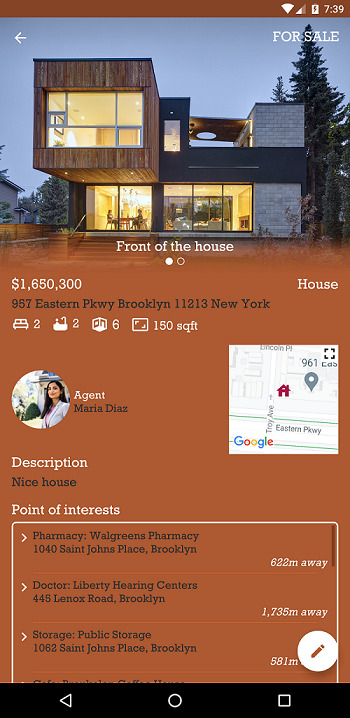

# Projet Real Estate Manager
**P9 de la formation "Developpeur.se d'Application Android" d'Openclassrooms**

Création d'une application permettant à des agents immobilier d'une même agence de gérer des biens.

Fonctionnalités:
- Afficher la liste des biens
- Rechercher des biens selon différents critères
- Ajouter/Modifier un bien immobilier avec des photos provenant de sa galerie photo ou de l'appareil photo
- Afficher le profil d'un bien
- Accéder à une carte qui affiche tous les biens à l'aide de punaises
- Localiser l'agent
- Afficher les biens prit en charge par un agent sur son profil
- Possibilité de changer de photo de profil et de nom d'utilisateur
- Stockage des données sur Firestore et Room (mode hors-ligne)

## Screenshots
.  
..

**Affichage tablette:**

## Prerequis
**Obtenir le projet:**
Clicker sur "Clone or Download" en haut à droite du projet sur Github, télécharger et extraire
le fichier zip sur votre ordinateur.

## Installation
Dans Android Studio, ouvrez le projet que vous venez de télécharger
et, si ce n'est pas fait automatiquement, cliquer sur "Sync project with Gradle Files" (menu "File")
puis clicker sur "Build Project" (menu "Build").

**Lancer l'application:** Cliquer sur le bouton "play" ou sélectionnez "Run 'app' " dans le menu "Run".

## Librairies

- FirebaseUI
- FirebaseStorage
- Places
- Room
- Koin
- Glide
- Retrofit
- Gson
- Espresso
- AndroidX
- Content Provider
- WorkManager
- ActivityResult

